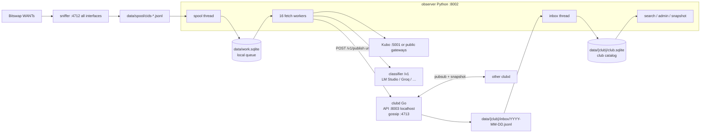
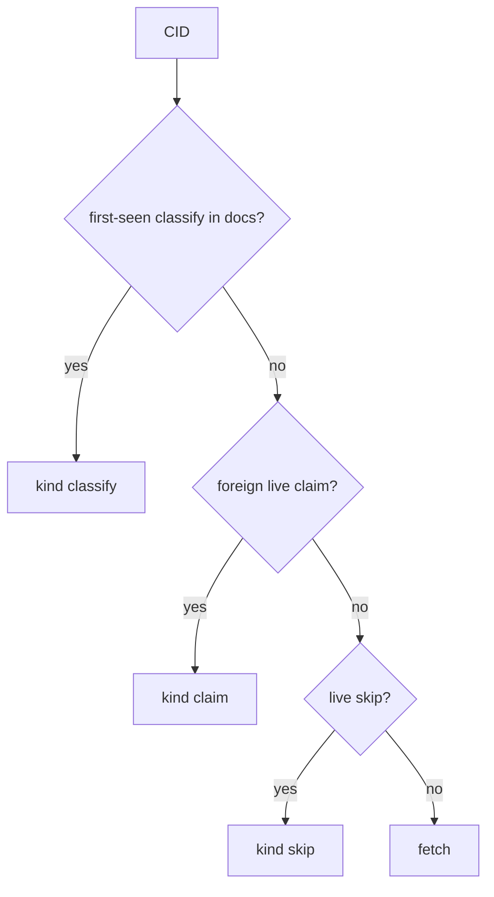
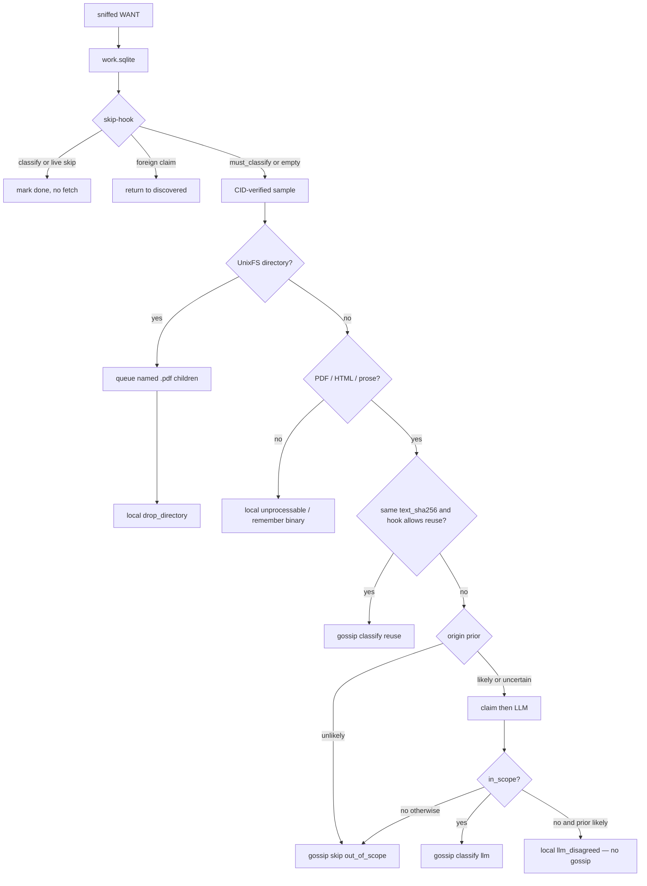

# Overview

Observers sniff Bitswap WANTs, fetch a CID-verified sample, classify
in-scope documents with a local OpenAI-compatible model, and gossip the
**signed metadata**. The catalog is that gossip. There is no central
index and no file bytes on the wire.

Academic is the shipped club. One process joins one club (`club.id`).
Wire format: [PROTOCOL.md](PROTOCOL.md). Field slugs:
`clubs/academic/fields.txt`.

This page is the system: processes, local vs club state, skip-hook,
classify path, labels, reports, and catch-up. Defaults below are from
`config.toml.example`.

## What v1 does not do

- Gossip file bytes, search queries, or results
- Last-write-wins on a CID’s classify (history is kept)
- Treat one classify as enough to stop every other node (a second
  independent vote is requested)
- Gossip `unprocessable` mime skips or `llm_disagreed`
- Run a chain, attestations, or a privileged catalog

## Processes

`make start` launches **clubd**, then **observer**. Observer keeps the
**sniffer** running. When the live work queue is at cap
(`fetch.max_queue` = 400), spool ingest skips new raw WANTs and evicts
raw to admit `dag-pb`; Bitswap peers stay connected.



| process | bind | role |
| --- | --- | --- |
| sniffer | `0.0.0.0:4712` | Passive Bitswap WANT listener. Never requests or serves content. |
| observer | `0.0.0.0:8002` | Work queue, fetch, classify, FTS search, admin. Only SQLite writer. |
| clubd | `127.0.0.1:8003`, `0.0.0.0:4713` | Sign, verify, inbox, gossip, snapshot stream. |

8003 must stay localhost. `POST /v1/publish` stamps `club`, `publisher`
(libp2p peer ID), `v=1`, and an Ed25519 `sig` from `data/identity.key`.
Browsers never talk to 8003.

8002 may be public. Set an admin password first. Guests can search and
propose reports. `GET /api/snapshot` is localhost-only; clubd pulls it
for late joiners.

Join: Admin → Peers (same club), or put a peer’s multiaddr from
`http://127.0.0.1:8003/id` in `club.bootstrap_peers`. Saving in admin
dials without restart. On a LAN, mDNS service
`ipfs-observer-club-{club}` finds others.

## On disk

```
data/
  identity.key          clubd libp2p key (signer = publisher)
  work.sqlite           sniffed CIDs this node has not finished
  spool/cids-*.jsonl    sniffer output
  llm.json              classifier backends + keys (0600, never sent to the browser)
  admin.json            salted admin password
  session.key           admin cookie HMAC
  {club}/
    club.sqlite         verified gossip (catalog)
    inbox-offsets.json  ingest cursor (not in the jsonl dir)
    inbox/YYYY-MM-DD.jsonl
```

`config.toml`, `data/`, and `.secret` are not in git. Switching
`club.id` switches catalog, inbox, gossip topics, mDNS, and snapshots.
Restart after a club change.

## Local vs club

| state | where | gossiped? |
| --- | --- | --- |
| classify (`llm` or `reuse`) | `classifies` + first-seen `docs` | yes |
| skip `out_of_scope` (legacy `not_academic`) | `skips` | yes |
| skip `directory` | work queue only (`drop_directory`) | no |
| skip `unprocessable` (images, CSS, JS, short PDFs) | work queue only | no |
| `llm_disagreed` | work queue, expires like unprocessable | no |
| claim | `claims` keyed by **publisher** | yes, short lease |
| report `wrong` / `abusive` / `clear` | `reports` keyed by `(cid, publisher)` | yes |
| guest report proposal | `report_proposals` | no, until admin accepts |
| alias | `aliases` latest per publisher | yes |
| blacklist | `blacklisted` | no, this machine only |
| WANTs / peer counts | `work.sqlite` | no |

clubd appends **verified** lines to the inbox, then publishes. Python
ingest is the only catalog writer. Inbox older than `inbox_keep_days`
(7) is deleted; total size capped at `inbox_max_bytes` (64 MiB). Live
gossip: 60 **new** payloads per publisher per minute; duplicates drop.

## Catalog

`messages` is the append-only log (`payload_hash` = SHA-256 of canonical
unsigned JSON). Denormalized tables:

| table | key | rule |
| --- | --- | --- |
| `classifies` | `payload_hash` | every signed classify; not last-write-wins |
| `docs` | `cid` | **first-seen** classify; FTS (`filename`, `field`, `topic`, `keywords`) |
| `skips` | `cid` | latest live skip; never hides a classify |
| `claims` | `publisher` | at most one live lease per node |
| `reports` | `(cid, publisher)` | latest reason wins; `clear` deletes that row |
| `aliases` | `publisher` | latest name; empty clears |

A message with a different `club` is dropped. A blacklisted `publisher`
is ignored on this node only.

## Discovery

Sniffer writes `{cid, peer, ts}` lines. Spool ingest:

- drops invalid CIDs and codecs `libp2p-key`, `json`, `dag-json`,
  `dag-cbor` (not documents)
- UnixFS `dag-pb` **is** queued: that is how IPFS stores PDFs. A
  directory is dropped after the first block and is **not** gossiped.
  PDF children named in that block are queued (`source=named`, at
  most `max_dir_docs` per folder, `max_named` live). HTML in a folder
  is left to ordinary Bitswap sniff. No tree walk.
- drops CIDs this node already marked locally unprocessable
- at cap, **skips new raw** WANTs and **evicts raw** to admit `dag-pb`
  (Bitswap is mostly raw leaves; FIFO would starve PDF roots). New
  `dag-pb` still waits when the live queue is already UnixFS
- counts distinct peers per CID; prefers `prefer_min_peer_count` (2),
  falls back to `min_peer_count` (1)

Workers take **named PDFs, then HTML, then sniffed `dag-pb`, then raw**.
A `source=report` row (second vote or a `wrong` report) or
`source=named` (PDF from a dropped folder) survives prune/age.

Prune drops sniffed rows older than `max_age_seconds` (900). Cap is
400 live `discovered`/`processing` rows. `unixfs_reserve` (80) keeps
that many slots free of sniffed raw. Folders are forgotten after fetch
via `drop_directory`. Gateway fetches give up after 6s.

## Skip-hook

Before fetch, `lookup_cid` returns the first match:



- **Classify** — do not fetch, unless `must_classify` (below).
- **Foreign claim** — park until `until` or a classify/skip lands. This
  node’s **own** lease is ignored so a claim cannot stall the claimer.
- **Skip** — do not fetch if the skip is live. `out_of_scope` persists.
  `directory` skips that still arrive from older nodes also persist, but
  this node does not publish them. Other skip reasons expire after
  `skip_ttl_seconds` (6h). A skip never hides a live classify.

`must_classify` turns the hook **off** (and turns fingerprint reuse
off) when this node has not published a classify for the CID and either:

1. a `wrong` report exists, or
2. exactly one **independent** classify exists and this node is not
   that publisher.

Independent means `classifier.kind != reuse`. Two independent
classifies, or this node already published, restore the skip-hook.

On ingest of a classify, `maybe_enqueue_second` queues the CID as
`source=report` if this node should cast the second vote and the live
queue is not at cap.

## CID path

Bytes stay in the worker. Every raw block is hashed against the CID
before use. Optional `[fetch] ipfs_api` is tried before public
gateways. Budget: 2 MiB (8 MiB for a small PDF), 6 child blocks, 1500
kB/s, 16 fetchers behind the classifier slot(s).



**Origin prior** (academic club): cheap markers — DOI, arXiv, ORCID,
repository, university, course notes, dataset, thesis. Origin counts;
the page does not have to look like a paper. A PDF with a short extract
still goes to the model (`uncertain`); only HTML/plain with no origin
markers and little text is `unlikely`. `likely` / `uncertain` go to the
model. `unlikely` gossips `out_of_scope`.

**LLM `in_scope` false:**

- prior `likely` → local `llm_disagreed` only. Other nodes may still
  fetch it. No `field=other` classify.
- prior uncertain/empty → gossip `out_of_scope`.

**Claim:** advertised only immediately before the LLM call. TTL 900s.
clubd drops a second live claim from the same publisher (refresh of the
same CID is allowed). Catalog keys claims by publisher.

**Fingerprint:** SHA-256 of whitespace-normalized UTF-8 text
(`max_text_chars` = 3000). Same hash, new CID → `classifier.kind=reuse`
copies field/topic/keywords. Reuse does not vote and is not used when
`must_classify` is set.

If clubd is down, the worker returns the CID to `discovered` without
burning fetch retries.

## Publish and ingest

```mermaid
sequenceDiagram
  participant W as worker
  participant D as clubd
  participant I as inbox JSONL
  participant G as gossip peers
  participant N as other observer
  W->>D: POST /v1/publish unsigned body
  D->>D: stamp club, publisher, v; sign identity.key
  D->>D: claim policy (429 if second live claim)
  D->>I: append verified line first
  D->>G: pubsub ipfs-observer-club/v1/{club}/{kind}
  Note over W,I: local ingest reads the same inbox
  G->>N: verify sig + canonical JSON
  N->>N: ingest_message → club.sqlite
```

Topics: `ipfs-observer-club/v1/{club}/{claim,skip,classify,alias,report}`.
Canonical JSON must match on Python (`observer/protocol.py`) and Go
(`clubd/internal/canon`). `sig` is hex Ed25519 over the unsigned
canonical bytes. Timestamps are Unix seconds, integers only.

Kinds and fields: [PROTOCOL.md](PROTOCOL.md).

## Labels vs search

Search FTS reads **`docs`** (first-seen classify). The UI overwrites
`field` / `topic` / `keywords` with a **vote**:

- one ballot per publisher (latest classify)
- `reuse` does not vote; if a CID has only reuse rows, those are used
- `field` and `topic`: plurality winner
- keywords: more agreement first, split terms last; at most 10 terms

So the skip-hook and the search index can show the first publisher’s
labels while the row on screen shows the vote.

## Reports

Filed from search (`POST /api/report`).

| who | what happens |
| --- | --- |
| logged-in admin | this node publishes immediately |
| guest | local `report_proposals` only; 8 / 10 min / IP |

Admin **Guest reports**: Accept publishes that reason as this node;
Reject drops the proposal. Search shows **reported** after a guest
submit.

| reason | effect |
| --- | --- |
| `abusive` | one accepted report hides the CID from search/browse club-wide. Classifies stay. Not a vote. |
| `wrong` | every node that has **not** classified this CID fetches and runs the model (no skip-hook, no reuse). Nodes that already classified, including the reporter, do not re-run. |
| `clear` | retracts **that publisher’s** report only |

Admin can restore (publish `clear` for this node) or blacklist a
publisher. Blacklist drops that node’s events on this machine only.

## Catch-up

Libp2p protocol `/ipfs-observer-club/v1/{club}/snapshot`. The serving
peer GETs `http://127.0.0.1:8002/api/snapshot` (classify, current
alias, report, then `out_of_scope` skips if room remains). Directory
and unprocessable skips are omitted. Documents win when the cap is
tight. Default cap `snapshot_limit` = 20 000 lines. The requester verifies
Default cap `snapshot_limit` = 20 000 lines. The requester verifies
each line the same way as gossip. Snapshot is cooldown-limited per
peer, not rate-limited per message.

## Trust

Open swarm. A valid signature is enough to ingest. The skip-hook trusts
first-seen classify / one abusive report the same way. Display labels
are the only multi-node vote. Fetched blocks that do not match the CID
are discarded.
